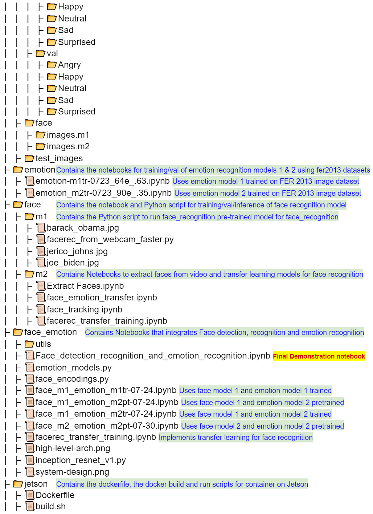
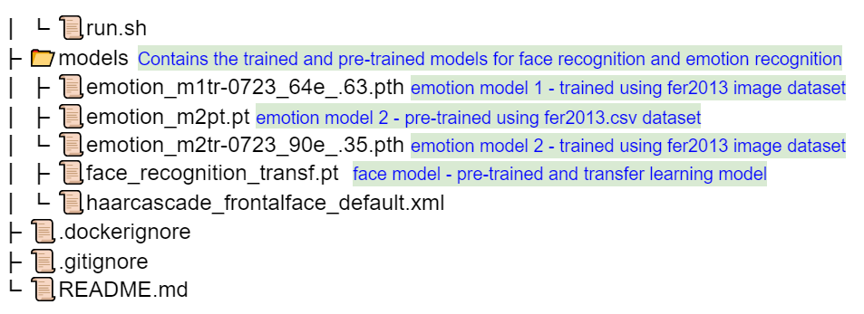

# Real-Time Face & Emotion Recognition using face images and Deep Learning

### *W251 Final Project*

#### Team

###### Diana Chacon, Jerico Johns, Josh Jonte, Sudhrity Mondal

#### **Class: W251-2 Tuesday 2:00 PM** 
#### **Semester: Summer 2021**
#### Professors:

###### **Darragh Hanley & Brad DesAulniers**

## Objective

Our team put together a system for recognizing face and basic emotional state using a video feed and the Nvidia Jetson Xavier NX Developer Kit. The video feed can be from a camera attached to the Jetson or a video file.

#### Github repository and contents

The Github repository used is as follows:

https://github.com/sudhrity/mids-w251-project 

The repository directory structure, files and high level descriptions are shown in the images below

The Project paper is available using the following link. https://github.com/sudhrity/mids-w251-project/blob/main/Real-Time%20Face%20%26%20Emotion%20Recognition%20using%20face%20images%20and%20Deep%20Learning%20-%20W251%20Final%20Project.pdf

​	

